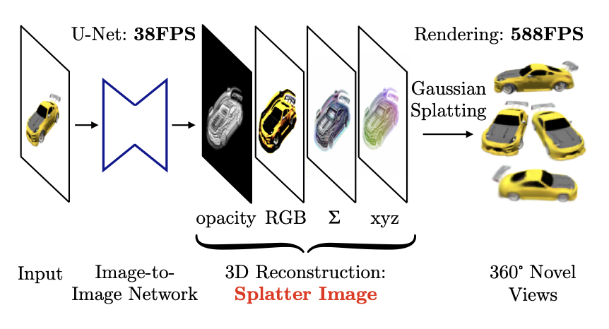

# Feedforward Gaussian Splatting

3D Gaussian Splatting[^3dgs] comprises the 3D Gaussian primitive, the rendering pipeline, and the optimization method.
Taking away the optimization step from 3D Gaussian Splatting, we are left with a flexible primitive for 3D scenes and a way to render them while allowing for backpropagation.

[^3dgs]: _3D Gaussian Splatting for Real-Time Radiance Field Rendering_ (Kerbl et al., SIGGRAPH 2023)

This means we can use various models to regress 3D Gaussian parameters from image inputs without 3D supervision.
In particular, we can use a neural network as the model, which allows us to regress 3D Gaussians in a single forward pass.
This is known as _Feedforward Gaussian Splatting_.

```math
\begin{aligned}(\mu, \Sigma, c, \alpha) &= \mathcal{N}_\phi(I) \\
\hat{I} &= \mathrm{render}(\mu, \Sigma, c, \alpha) \end{aligned}
```

The motivation for Feedforward Gaussian Splatting follows from the usual advantages that deep learning has over classical machine learning.
Using a neural network lets the model to learn priors from large-scale datasets.
This allows Feedforward Gaussian Splatting models to work on sparse views and generalize between scenes.
The original 3D Gaussian Splatting approach, in contrast, must be optimized per scene.

## Problem definition

Feedforward Gaussian Splatting can be potentially applied to a number of problems:

- Scene
  - Focus: object-centric / scene-centric
  - Motion: dynamic / static
  - Scale: bounded / unbounded
- Camera(s)
  - View count: single / stereo / multi-view
  - Motion: dynamic / static
- Data
  - Input poses: SfM poses / unposed

We explore a few recent methods in Feedforward Gaussian Splatting below, focusing on the differences between single-view and multi-view reconstruction.

## Single-view

Single view 3D reconstruction is inherently ill-posed, necessitating strong geometry and appearance priors.
Tatarchenko et al. suggest that single view reconstruction models perform image classification rather than 3D reasoning.[^singleview]
This makes Feedforward Gaussian Splatting a suitable approach as the neural network portion of the model can perform recognition tasks.

[^singleview]: _What Do Single-view 3D Reconstruction Networks Learn?_ (Tatarchenko et al., CVPR 2019)

### Splatter Image

[Splatter Image](https://szymanowiczs.github.io/splatter-image)[^splatter-image] uses a CNN to perform single-view object reconstruction with 3D Gaussians. A U-Net maps a $H \times W \times 3$ input image to a $H \times W \times D$ image, where the $D$ output channels represent 3D Gaussian parameters.
This means the output image contains $HW$ 3D Gaussians.

[^splatter-image]: _Splatter Image: Ultra-Fast Single-View 3D Reconstruction_ (Szymanowicz et al., CVPR 2024)



Despite the simple approach, Splatter Image achieves SOTA results on ShapeNet while trained with a single GPU.
The feedforward nature of the model allows for fast reconstruction at 38fps.

## Multiple views

Multi-view reconstruction differs from single-view reconstruction in that information between views must be shared to result in a single consistent 3D representation.
Cases with sparse views are especially challenging as the above conditions must be met while avoiding overfitting on the small number of inputs.

### pixelSplat

[pixelSplat](https://davidcharatan.com/pixelsplat/)[^pixelsplat] shares information between views in the form of epipolar attention[^epipolar] to perform scene reconstruction from stereo inputs.
Epipolar attention is a form of cross-attention where tokens are sampled along epipolar lines, which allows tokens to attend to other views while enforcing epipolar constraints.
To avoid overfitting, variational inference is used to sample 3D Gaussian parameters instead of directly using neural network outputs.

[^pixelsplat]: _pixelSplat: 3D Gaussian Splats from Image Pairs for Scalable Generalizable 3D Reconstruction_ (Charatan et al., CVPR 2024)
[^epipolar]: _Epipolar Transformers_ (He et al., CVPR 2020)


pixelSplat is evaluated on RealEstate10k and ACID, both large-scale single-view datasets.
Multi-view inputs are chosen by sampling different frames in time.
pixelSplat greatly improves performance and speed over baselines.

<video autoplay muted loop>
  <source src="./pixelsplat-output.mp4" />
</video>


### MVSplat

[MVSplat](https://donydchen.github.io/mvsplat/)[^mvsplat] also focuses on large-scale scene reconstruction with transformers, but a different approach is taken to share information between views.
A multi-view transformer to extract features from input views, which are then matched into cost volumes via plane-sweeping.
A U-Net predicts depth maps and 3D Gaussian opacities, covariances, and colors from the cost volumes.
The depth maps are then unprojected to yield 3D Gaussian centers.

[^mvsplat]: _MVSplat: Efficient 3D Gaussian Splatting from Sparse Multi-View Images_ (Chen et al., arXiv)


MVSplat operates on cost volumes which store feature similarities between views.
This allows MVSplat to learn feature matching instead of regression, leading to better generalizability and out-of-dataset performance over pixelSplat.
MVSplat also promises 10× fewer parameters and 2× faster inference speed over pixelSplat.

<video autoplay muted loop>
  <source src="./mvsplat-output.mp4" />
</video>


### DUSt3R

[DUSt3R](https://dust3r.europe.naverlabs.com)[^dust3r] isn't a 3D Gaussian model _per se_, but it's an interesting model that outputs point clouds.
It also uses transformers to obtain feature maps per view, which are then decoded with more transformers with cross-view attention to exchange information between views.

[^dust3r]: _DUSt3R: Geometric 3D Vision Made Easy_ (Wang et al., CVPR 2024)

pixelSplat and MVSplat combine deep features with strong geometric priors - pixelSplat with epipolar geometry, and MVSplat with cost volumes.
DUSt3R does not enforce any 3D priors, instead choosing to learn all relevant priors from training data.
In fact, DUSt3R is entirely unconstrained and camera poses and intrinsics are learned.

### Takeaways

All of the above multi-view reconstruction models use cross-view attention to exchange information between views.
pixelSplat further augments information sharing between views with epipolar attention and MVSplat with cost volume matching.

This difference in approach between pixelSplat and MVSplat is worth noting.
pixelSplat works via feature aggregation, performing 3D reconstruction by learning and regressing 3D scenes on their 2D views.
MVSplat, instead, focuses on similarities between views explicitly represented with cost volumes, performing 2D feature matching to obtain depths.

All methods are also pixel-aligned, i.e. end-to-end locality between pixels and 3D Gaussians is preserved.
Each pixel of the input image corresponds to $n$ Gaussians, resulting in $HWn$ total Gaussians.
